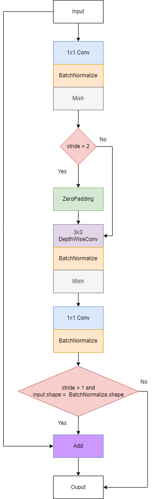

# Sketch2Visual: Deep Learning-Powered Web App

Welcome to Sketch2Visual, a web application that leverages deep learning to predict objects from user-drawn sketches. With the power of neural networks, our system can identify the sketched object and connect to the Bing Image Search API to provide visualizations in real-time.

## Demo
Check out our live demo [here](https://huggingface.co/spaces/duongve/Sketch2Visual), where you can experience the magic of Sketch2Visual firsthand. Feel free to draw sketches and witness the system's accurate predictions and Bing Image Search visualizations.


## Model Architecture
- We believe in transparency, and to showcase the inner workings of our system, we've provided details about the model architecture. Our deep learning model is trained on [the QuickDraw dataset](https://github.com/googlecreativelab/quickdraw-dataset), a rich collection of doodles contributed by people around the world. The architecture incorporates state-of-the-art techniques in computer vision and neural networks to deliver accurate and efficient results.

- In this project, we employed two deep learning models, one with an architecture similar to VGGNet, and the other utilizing the 'Inverted Residual Block' architecture. Both models yielded excellent results. However, we chose to use the model with the 'Inverted Residual Block' architecture due to its superior efficiency and less complex structure, making it suitable for devices with limited computational resources.

- Model's architecture:


> Inverted Residual Block.


- The model's architecture is designed to handle the complexity of sketch recognition while maintaining a user-friendly and responsive web interface. We encourage you to explore the code and delve into the intricacies of our model.

## Setup

### Clone the repository

```
git clone https://github.com/your-username/Sketch2Visual.git
cd Sketch2Visual
```

### Install libraries
Switch to the `Web Application` directory, create a new virtual environment, and install the required packages:
```
python -m venv ./venv
source ./venv/bin/activate
pip install -r requirements.txt
```

### Webapp

#### Native

After installing the required libraries, you can run the webapp using the following command:

```
uvicorn main:app
```
If the previous command doesn't work, please use this command instead.

```
python -m uvicorn main:app
```

The webapp should be available at [http://127.0.0.1:8000](http://127.0.0.1:8000).

#### Docker

Alternatively, you can also run it via Docker:

```
docker build . -t quickdraw-webapp
docker run -p 443:443 quickdraw-webapp
```

The webapp should be available at [http://127.0.0.1:443](http://127.0.0.1:443).

## Contributing
We welcome contributions from the community to enhance Sketch2Visual. Whether you want to improve the model, add new features, or fix bugs, please feel free to submit pull requests.

## License
This project is licensed under the [MIT License](LICENSE) - see the [LICENSE](LICENSE) file for details.

Feel free to explore, use, and contribute to Sketch2Visual! If you have any questions or feedback, please open an issue or reach out to us.

Happy sketching! 🎨✨
